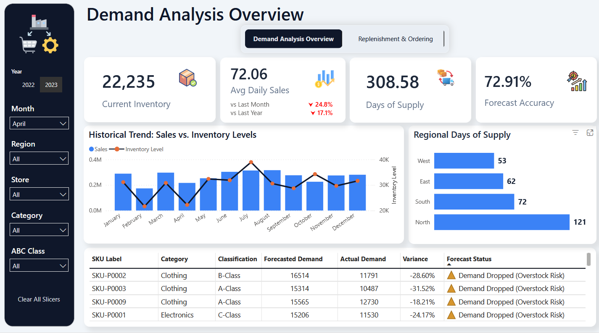
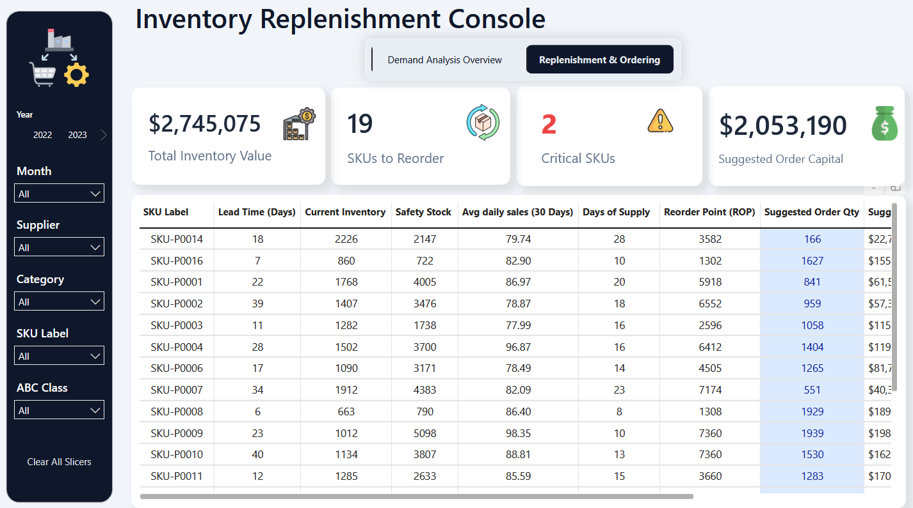
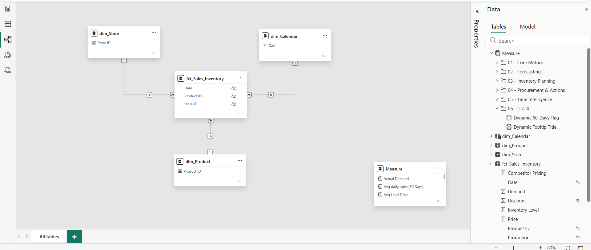

# 📦 Demand & Replenishment Console

### From reactive inventory reporting to proactive replenishment decisions.

A Power BI supply chain analytics solution designed to separate **demand planning** from **day-to-day inventory execution**.

The project combines demand analysis, forecasting, inventory monitoring, ABC classification, and replenishment logic into a focused decision-support application.

---

## 🎯 Business Problem

Supply chain teams often use the same reporting interface for two fundamentally different tasks:

- Long-term demand planning
- Daily procurement and replenishment

Combining both creates what I call a **"Dashboard Identity Crisis"** — too much information for planners, not enough focus for buyers, and unnecessary cognitive load for operational teams.

This can contribute to:

- Delayed purchasing decisions
- Stockout risk
- Excess inventory
- Tied-up working capital
- Manual procurement calculations
- Difficulty identifying priority SKUs

The objective was not simply to build another dashboard.

It was to design an analytical workflow that helps answer:

> **What is happening? → What is likely to happen? → What should we do next?**

---

# 💡 Solution

I designed a **dual-module Power BI application** that physically separates strategic demand analysis from operational replenishment.

### Module 1 — Demand Analysis

Focused on understanding demand behavior and inventory performance.

### Module 2 — Replenishment & Ordering

Focused on translating inventory conditions into actionable procurement decisions.

---

# 📊 Demand Analysis Overview



The Demand Analysis module provides a high-level view of:

- Current inventory
- Average daily sales
- Days of supply
- Forecast accuracy
- Sales vs. inventory trends
- Regional inventory coverage
- Forecast variance
- SKU-level demand classification

### Key analytical features

**Dynamic ABC Analysis**

Products are classified based on cumulative revenue contribution to help prioritize high-value SKUs.

**Demand Forecasting**

A lightweight forecasting approach provides a forward-looking demand signal while maintaining visibility into forecast variance.

**Forecast Guardrails**

The dashboard highlights significant deviations between forecasted and actual demand to help identify potential overstock or demand deterioration.

**Inventory Coverage**

Days of Supply provides visibility into how long current inventory can support expected demand.

---

# 🔄 Replenishment & Ordering



The second module converts inventory analysis into procurement actions.

### Key metrics

- Total Inventory Value
- SKUs to Reorder
- Critical SKUs
- Suggested Order Capital

### Replenishment logic

The console calculates:

**Reorder Point**

> Reorder Point = Demand During Lead Time + Safety Stock

**Suggested Order Quantity**

The model compares current inventory against the calculated replenishment threshold and generates a suggested quantity to order.

The result is a buyer-focused view that moves the process away from manual purchasing calculations.

---

# 🧠 Data Model



The analytical model uses a structured dimensional architecture connecting:

- Product
- Store
- Calendar
- Sales
- Inventory

The model separates dimensions from transactional data to support reusable measures, consistent filtering, and scalable Power BI analysis.

### Core model components

| Component | Purpose |
|---|---|
| `dim_Product` | Product attributes and classification |
| `dim_Store` | Store-level analysis |
| `dim_Calendar` | Time intelligence |
| `fct_Sales_Inventory` | Historical sales and inventory transactions |
| Measures | Centralized analytical calculations |

---

# ⚙️ Technical Implementation

### Power BI

Used as the primary analytical and visualization platform.

### DAX

Developed measures for:

- Demand calculations
- Average daily sales
- Inventory metrics
- Forecasting
- ABC classification
- Reorder Point calculations
- Suggested Order Quantity
- Days of Supply
- Variance analysis

### Power Query

Used for:

- Data cleaning
- Transformation
- Data preparation
- Handling inconsistent source values

### Data Modeling

Designed relationships between dimensions and fact data to provide reliable filtering and reusable analytical logic.

---

# 🛡️ Data Quality & Reliability

Real-world ERP data is rarely perfect.

The model includes safeguards for problematic values such as:

- Blank revenue
- Null values
- Negative revenue
- Missing demand
- Zero-demand scenarios

These safeguards prevent misleading KPIs and calculation errors from propagating into decision-making.

---

# 📈 Business Value

The solution shifts the workflow from:

### Reactive Reporting

> "What happened?"

to:

### Proactive Decision Support

> "What should we do next?"

The resulting workflow helps:

- Reduce manual purchasing guesswork
- Identify critical inventory risks
- Prioritize high-value SKUs
- Improve visibility into inventory coverage
- Balance stockout risk against excess inventory
- Support more disciplined procurement decisions

---

# 🧰 Tools & Technologies

- **Power BI**
- **DAX**
- **Power Query**
- **Data Modeling**
- **Excel**
- **Supply Chain Analytics**
- **Inventory Planning**
- **Procurement Analytics**

---

# 📁 Project Structure

```text
demand-replenishment-console/
│
├── README.md
│
├── assets/
│   ├── demand-analysis-overview.png
│   ├── replenishment-console.png
│   └── data-model.png
│
├── documentation/
│   ├── methodology.md
│   └── data-source.md
│
└── powerbi/
    └── Demand-Replenishment-Console.pbix
